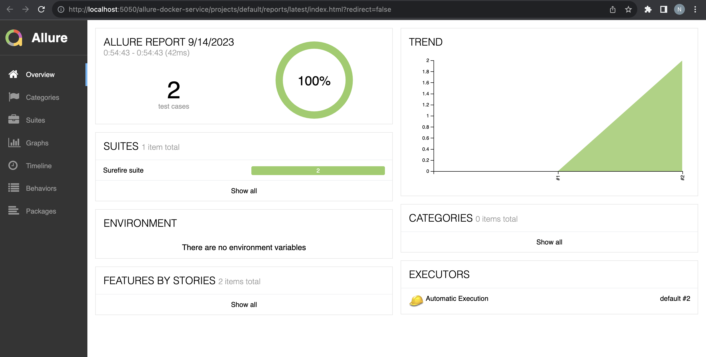

## allure-server-standalone-template

### Pre-requisites - 

- Java 11 or higher
- IDE - [IntelliJ](https://www.jetbrains.com/edu-products/download/#section=idea) or supporting IDE
- Maven
- [Docker](https://www.docker.com/products/docker-desktop/)

### Instructions - 

- Clone the Project Repository
```
git clone <repository-url - HTTPS / SSH>
```

- Open cloned Repository in IDE
- Build the Project 
```
mvn clean install
```

- Execute first set of Test cases
```
mvn clean test -Dtest=com.example.SetOfTwoTestCase 
```


- Open Docker Desktop and Terminal to pull Allure Server Image from Docker Hub
```
docker pull frankescobar/allure-docker-service
```


- Start Docker Container at port 5050 and mount generated allure-results
```
docker run -p 5050:5050 -e CHECK_RESULTS_EVERY_SECONDS=3 -e KEEP_HISTORY=1 \
frankescobar/allure-docker-service
```

- Open new terminal window in your IDE and execute 'report_generation.sh' file using command - "./report_generation.sh".If you encounter a 'permission denied' error, resolve it by executing the command 'chmod +x report_generation.sh' to grant execution permission to the file. Afterward, you can run the 'report_generation.sh' script again using the command './report_generation.sh'.
```
chmod +x report_generation.sh
```
```
./report_generation.sh
```

- Navigate to Allure service running at 5050 port to get the Report - <br>
  [http://localhost:5050/allure-docker-service/latest-report](http://localhost:5050/allure-docker-service/latest-report)
  


- Execute second set of Test Cases
```
mvn clean test -Dtest=com.example.SetOfFourTestCase 
```

- Execute shell script file again 
```
./report_generation.sh
```

- Refresh this link to get the latest report - <br>
  [http://localhost:5050/allure-docker-service/latest-report](http://localhost:5050/allure-docker-service/latest-report) <br><br>
  


